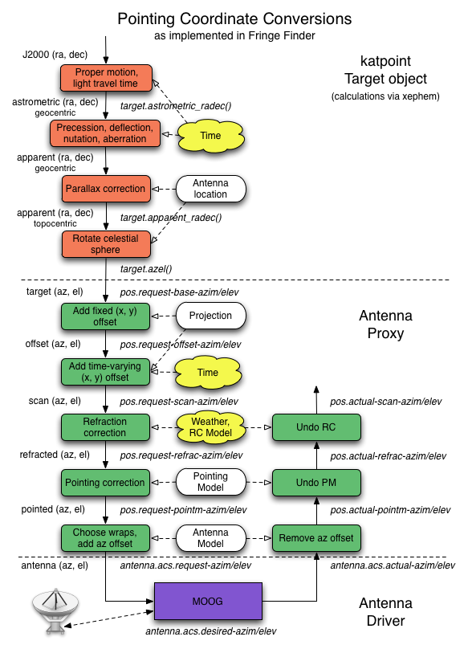

.. _math_pointing_spec_record:

Mathematical Details of Antenna Pointing Correction
===================================================

Pointing an antenna involves many coordinate transformations. The complete chain
of coordinate conversions from the standard J2000 right ascension and declination
found in a catalogue to the actual commanded azimuth and elevation values sent
to the low-level antenna driver is shown below. For illustration the graph includes
the KAT-7 Fringe Finder sensor names which correspond to each stage of the chain.

.. _pointing_coordinate_conversions:

   The chain of pointing coordinate conversions.

Two transforms in this chain are explained in more detail below: refraction
correction and pointing correction via a pointing model. These are implemented
in the antenna proxy, based on the :mod:`katpoint` library.

Refraction Correction
---------------------

The atmosphere refracts incoming electromagnetic waves, which introduces a delay
and changes the apparent angle of incidence at the Earth's surface. The former
affects delay tracking in the correlator, while the latter affects antenna
pointing. Specifically, the source is perceived to be higher in elevation than
it actually is. This section focuses on the pointing aspect of refraction.

KAT-7 and MeerKAT currently focus on the measurement of centimeter-wavelength
signals using dishes with a diameter of approximately 15 metres, which implies
a beamwidth of the order of one degree of arc. Since the maximum refraction
offset is of the order of half a degree at the horizon, this lessens the need
for highly accurate refraction models [Mangum1]_, which is a bigger problem
for arrays like ALMA.

At radio frequencies up to about a terahertz, refractive bending is independent
of frequency and antenna location, and depends instead on the ambient weather
conditions, the main variables being temperature, pressure and relative
humidity. There are various atmospheric models that calculate the refraction
offset to the elevation angle as a function of elevation angle and these three
variables. The most accurate of these are discussed in [Mangum2]_.

:mod:`katpoint` uses the simple refraction model in the VLBI Field System. The
specific version can be found in Field System version 9.9.2. As noted in the
Field System documentation [Himwich1]_, the refraction model originated with the
Haystack pointing system, but the documentation for this algorithm seems to have
been lost. It agrees well with the DSN refraction model, though.

The model uses the temperature and humidity to determine the dewpoint
temperature, which in turn is used to estimate the partial pressure of water
vapour in the atmosphere. The total pressure, partial pressure and temperature
are used to estimate the *surface refractivity* of the atmosphere, which
determines the maximum size of the refraction offset. The refraction offset also
changes approximately as the cotangent of the elevation angle, with its maximum
attained at the horizon. Finally, the elevation angle is corrected for
refraction by adding the calculated refraction offset to it.

Pointing Model
--------------

An antenna mount typically has small deviations from the ideal which causes
discrepancies in its pointing. The antenna *pointing model* models these
discrepancies with a combination of physically justified and ad hoc parameters.
The pointing model is fit to a set of pointing measurements, with a unique
subset of these parameters typically selected for each mount.

An ideal alt-azimuth mount has a horizontal azimuth ring with a vertical
elevation axis perpendicular to it that points at zenith. The usual deviations
include biases in azimuth and elevation encoders, a tilt of the azimuth ring
relative to the horizon, a tilt of the elevation axis relative to the azimuth
ring, misalignment of the RF and pointing axes, and gravitational sag.

Most telescopes rely on the same physical model to correct their pointing, with
the only difference being different names for the parameters. This standard
model is linear in the parameters, making it useable for small deviations only,
and it describes a common set of coordinate system deviations in the mount.

:mod:`katpoint` uses the VLBI Field System version of this model, specialised
for an alt-az mount. The exact description corresponds to the C implementation
of Field System version 9.9.0, which differs slightly from the official
description in [Himwich2]_ by introducing minor changes to the ad hoc parameters.

The pointing model calculates offsets to the azimuth and elevation angles as a
function of azimuth and elevation, which are added to the desired azimuth and
elevation to correct them. The azimuth and elevation offset angles are given by

.. math::
   :nowrap:

   \begin{eqnarray}
      \Delta A & = & P_1 + P_3 \tan E - P_4 \sec E + P_5 \sin A \tan E - P_6 \cos A \tan E + \nonumber \\
               &   & P_{12} A + P_{13} \cos A + P_{14} \sin A + P_{17} \cos 2A + P_{18} \sin 2A \nonumber \\
      \Delta E & = & P_5 \cos A + P_6 \sin A + P_7 + P_8 \cos E + P_9 E + P_{11} \sin E + P_{15} \cos 2A + \nonumber \\
               &   & P_{16} \sin 2A + P_{19} \cos 8E + P_{20} \sin 8E + P_{21} \cos A + P_{22} \sin A, \nonumber 
   \end{eqnarray}

respectively, where :math:`A` is the desired azimuth angle, :math:`E` is the
desired elevation angle and the model parameters are :math:`P_1` to
:math:`P_{22}`. All angles and model parameters have units of radians except for
:math:`P_9` and :math:`P_{12}`, which are scale factors and therefore unitless.
The alt-az mount specialisation makes parameter :math:`P_2` meaningless and
parameter :math:`P_{10}` the same as :math:`P_8` and therefore redundant, which
reduces the model to 20 parameters.

A short explanation of each parameter is given below together with some nominal
causes. The corresponding parameter in the TPOINT pointing model is also pointed
out. The parameters can be divided into two groups: six purely geometric terms
(:math:`P_1`, :math:`P_3`, :math:`P_4`, :math:`P_5`, :math:`P_6`, :math:`P_7`)
which will normally be present in any alt-azimuth mount, and the rest, which are
ad hoc terms modelling gravitional sag and other telescope-specific defects.
These ad hoc terms are only enabled in the pointing model if there is sufficient
evidence for them (although :math:`P_8` is frequently useful).

Pure geometric terms:

* :math:`P_1` (TPOINT parameter -IA) is the *azimuth offset*, which includes the   
  effects of encoder bias and *tilt around* (rotation of the azimuth ring
  around the vertical axis).
* :math:`P_3` (TPOINT parameter -NPAE) is the *left-right axis skew*, which
  describes non-perpendicularity of the azimuth and elevation coordinate axes.
  Specifically, it is the angle by which the apparent elevation axis tilts over
  to the left relative to the azimuth ring, where *left* means along the
  meridian with azimuth value 90 degrees less than the desired azimuth. This
  parameter may also include contributions of elevation and azimuth bearing
  wobble.
* :math:`P_4` (TPOINT parameter CA) is the *azimuth box offset* or *left-right
  collimation error*, which represents misalignment of the RF and pointing
  axes. Specifically, it is the angle by which the RF axis is offset from the
  pointing axis along the azimuth direction.
* :math:`P_5` (TPOINT parameter AN) is *tilt out*, which is a tilt of the
  azimuth ring towards true North.
* :math:`P_6` (TPOINT parameter -AW) is *tilt over*, which is a tilt of the
  azimuth ring towards true East.
* :math:`P_7` (TPOINT parameter IE) is the *elevation offset*, which includes
  the effects of encoder bias, *forward axis skew* and *elevation box offset*.
  These effects all appear as an elevation offset and cannot be distinguished
  from each other.

Ad hoc terms:

* :math:`P_8` (TPOINT parameter ECEC or HECE or -TF) is the maximum symmetric
  *gravitational sag* or *vertical flexure*, which is a downward deflection of
  the pointing axis experienced when the dish is pointing at the horizon. It
  models the effect of gravity on the dish structures under the assumption that
  the structures obey Hooke's Law. This parameter also includes the cosine
  component of the *elevation centering error*, which is misalignment of the
  elevation encoder and the actual tilt axis and may be traced to eccentricity
  in the elevation tilt drive wheel or encoder disk, or encoder *run-out*.
* :math:`P_9` (TPOINT parameter PEE1) is an excess scale factor in the elevation
  angle, which occurs when the encoder readout changes faster or slower than the
  actual antenna position. It is a unitless number.
* :math:`P_{11}` (TPOINT parameter ECES or HESE) is an asymmetric gravity or
  flexure term that also includes the sine component of the *elevation centering
  error*, which is misalignment of the elevation encoder and the actual tilt
  axis and may be traced to eccentricity in the elevation tilt drive wheel or
  encoder disk, or encoder *run-out*.
* :math:`P_{12}` (TPOINT parameter -PAA1) is an excess scale factor in the
  azimuth angle, which occurs when the encoder readout changes faster or slower
  than the actual antenna position. It is a unitless number.
* :math:`P_{13}` (TPOINT parameter ACEC or HACA) is the cosine component of
  the *azimuth centering error*, a misalignment of the azimuth encoder and the
  actual azimuth axis that may be due to eccentricity of the azimuth drive wheel
  or encoder disk, or azimuth encoder *run-out*.
* :math:`P_{14}` (TPOINT parameter -ACES or -HASA) is the sine component of
  the *azimuth centering error*, a misalignment of the azimuth encoder and the
  actual azimuth axis that may be due to eccentricity of the azimuth drive wheel
  or encoder disk, or azimuth encoder *run-out*.
* :math:`P_{15}` (TPOINT parameter HECA2) is the cosine component of an
  elevation nod twice per azimuth revolution.
* :math:`P_{16}` (TPOINT parameter -HESA2) is the sine component of an elevation
  nod twice per azimuth revolution.
* :math:`P_{17}` (TPOINT parameter -HACA2) is the cosine component of azimuth
  encoder tilt.
* :math:`P_{18}` (TPOINT parameter HASA2) is the sine component of azimuth
  encoder tilt.
* :math:`P_{19}` (TPOINT parameter HECE8) models higher-order distortions in the
  elevation encoder scale that vary eight times per revolution.
* :math:`P_{20}` (TPOINT parameter HESE8) models higher-order distortions in the
  elevation encoder scale that vary eight times per revolution.
* :math:`P_{21}` (TPOINT parameter -HECA) is the cosine component of an
  elevation nod once per azimuth revolution.
* :math:`P_{22}` (TPOINT parameter HESA) is the sine component of an elevation
  nod once per azimuth revolution.

.. [Mangum1] Jeff Mangum, NRAO, private communication.
.. [Mangum2] Jeff Mangum, "Atmospheric Refractive Signal Bending and Propagation
   Delay," ALMA Memo, 26 January 2009.
.. [Himwich1] Himwich, "Station Programs," Mark IV Field System Reference Manual,  
   Version 8.2, 1 September 1993, available at 
   `<ftp://gemini.gsfc.nasa.gov/pub/fsdocs/stprog.pdf>`_
.. [Himwich2] Himwich, "Pointing Model Derivation," Mark IV Field System
   Reference Manual, Version 8.2, 1 September 1993, available at
   `<ftp://gemini.gsfc.nasa.gov/pub/fsdocs/model.pdf>`_
